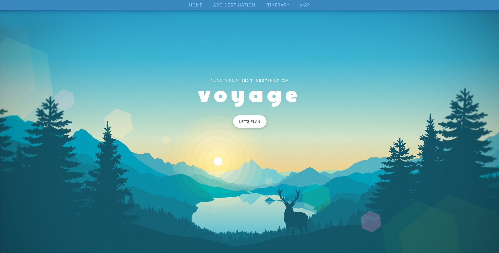
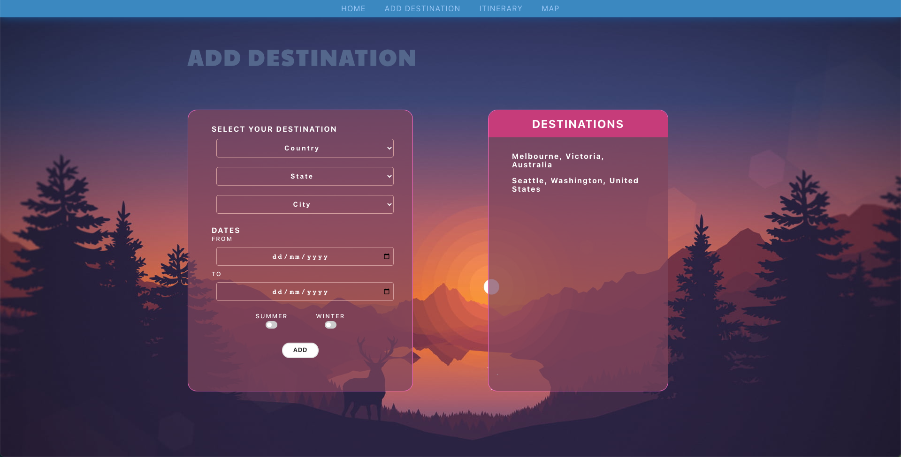
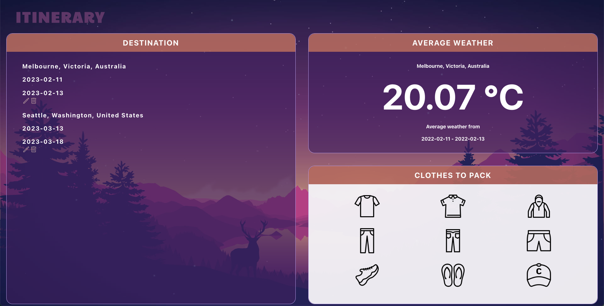
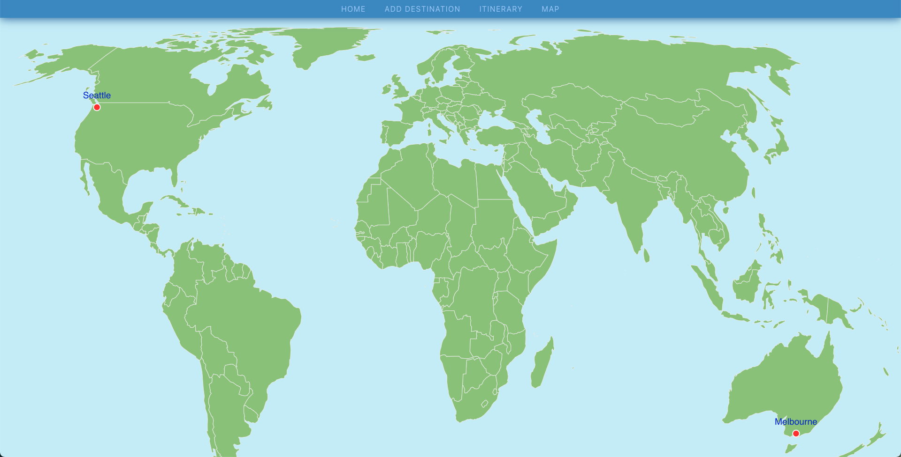

# :airplane: Vogage - Itinerary planning app
Project 4 with General Assembly

## :star: View my project [here](http://tinas-voyage.surge.sh/)! :eyes:

## :page_with_curl: About

This is the last project with the General Assembly Bootcamp. We were given the opportunity to showcase our skills and creativity and create whatever we like!

My app main purpose is to plan your holiday itinerary. It will be integrating 3 different APIs.
The idea was to use unrelated topics and make them relatable.

External:
- Weather API
- Location API

Internal:
- Clothing API

The app's main features will be for users to select their holiday destination, view the weather at the selected destinations, and produce a simple clothes packing guide.

The app displays a map to show the selected destinations.

Users can filter whether they want a summer or winter holiday, and if they have a specific date of travel, the app will display the countries in the desired weather conditions. *Coming soon...*

## :pencil2: Planning and Problem Solving
**Initial planning:**
- [Breakdown of the project](./readmeAttachments/Frontend_Plan.pdf) 
- [Wireframing](./readmeAttachments/wireframe.png)
- [Trello](./readmeAttachments/wireframe.png)

## :rocket: Technology used
- [React](https://reactjs.org/)
- [Sass](https://sass-lang.com/)
- [React Simple Maps](https://www.react-simple-maps.io/)

This is basically my map page. It is quiet simple to use. I was able to add the markers on then a destination is added.
- [Open-Meteo](https://open-meteo.com/)

Open-Meteo really useful weather API to get historical data, and it's completely free!
- [Country State City API](https://countrystatecity.in/)

Country State City API was clean and simple to use. Allowed me be get the list of countries, states and cities for my dropdown menus
- [OpenCage Geocoding API](https://opencagedata.com/api)

OpenCage Geocoding API is used for generating coordinates to pass into the weather API and map.
- [ICONS8](https://icons8.com/)

BEST ICONS SITE EVER! If you every need icons, use ICONS8! You can download most sizes for free and in a variety of different formats too. You can also edit the icons as needed.

### Dependencies
- **npm i -S react-simple-maps**

React Simple Maps

- **npm i sass**

Syntactically Awesome Style Sheets

- **npm i -S react-router-dom**

React Router in web applications

## :white_check_mark: Future features
- Render differnt clothing depending on the weather
- Be able to filter the locations by season
- Sort the Itinerary list
- Information card pop-up on the Maps page when the user clicks on a marker.

## :warning: Bugs :bug:
- Location API rendering some coordinates incorrectly on the map, e.g Abbotsford, VIC, AU
- Edit feature is buggy in general, sometimes the page will go blank when you click 'edit'. Sometimes it renders incorrect infomation. Other times it works :disappointed_relieved:

## :sob: Major hurdles
**The whole project!!!** 

Kidding...

In all honestly, the project was a big challenge. From the start, I had issues with my idea. I didn't know what I REALLY wanted to do, and that left me super uninspired. I was changing ideas as we were pitching it to the class.

- useEffect
I just didn't really know how to use this hook enough. Although I managed to get it to work, I'm not confidence in my understanding

- Dropdown list
Getting this to render the correct infomation on the Add Destination page was pretty straight-forward. It was when I had to do the same thing on the Edit Modal. That was a big nightmare, and it's still buggy. 

All my CRUD features worked until I kept adding more to it...

## Screenshots of the app 
10/02/2023

